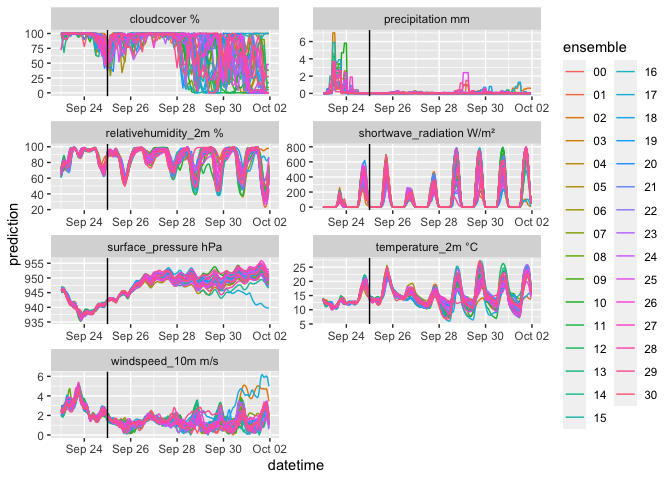
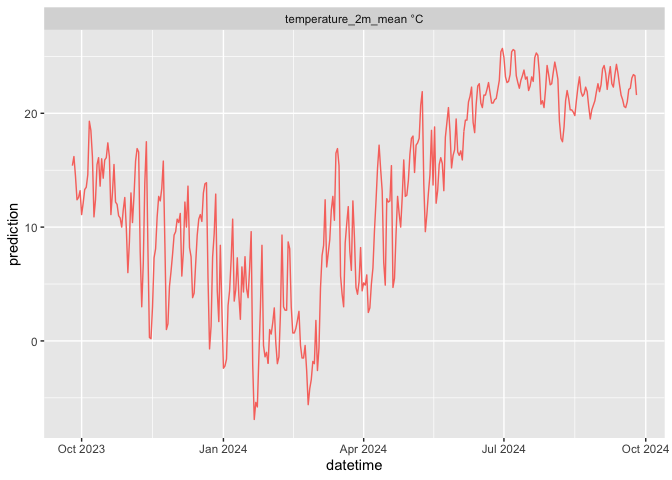
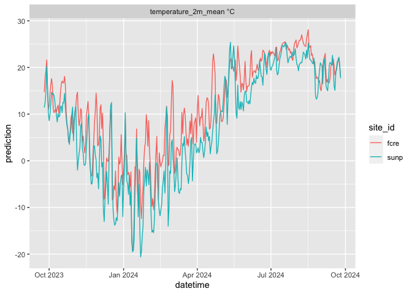
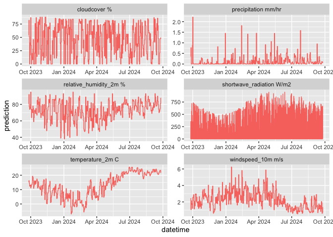

RopenMeteo
================

<!-- badges: start -->

[](https://github.com/FLARE-forecast/RopenMeteo/actions/workflows/R-CMD-check.yaml)
<!-- badges: end -->

R wrappers for APIs on Open-Meteo project. The Open-Meteo is a amazing
project that streamlines the access to a range of publicly historical
and forecasted meteorology data from agencies across the world. The free
access tier allows for 10,000 API calls per day. The paid tiers increase
the number of daily API calls (support for paid APIs in this package is
pending). Learn more about the Open-Meteo project at their website
(\[<https://open-meteo.com>\]) and consider supporting their efforts.

Open-Meteo citation: Zippenfenig, Patrick. (2023). Open-Meteo.com
Weather API (0.2.69). Zenodo. <https://doi.org/10.5281/zenodo.8112599>

The package includes additional functionally to facilitate the use in
mechanistic environmental/ecological models. This includes the
calculation of longwave radiation (not provided through the API) from
air temperature and cloud cover, the writing of output to the format
required by the General Lake Model (GLM), and the conversion to the
standard used in the NEON Ecological Forecasting Challenge that is run
by the Ecological Initiative Research Coordination Network
(\[<https://neon4cast.org>\]). Future functionally includes the temporal
downscaling of the daily climate projection output and the 6-hourly
seasonal forecast to the hourly time step.

The package uses a long format standard with the following columns

- `datetime` = date and time of forecasted value
- `reference_datetime` = the date and time of the beginning of the
  forecast (horizon = 0). Does not apply to historical weather.
- `site_id` = column to identify site location. If null in function call
  it defaults to latitude_longitude
- `model_id` = id of model that generated the forecast
- `ensemble` = ensemble member number (only for ensemble weather and
  seasonal forecasts)
- `variable` = forecasted variable
- `prediction` = forecasted value
- `unit` = units of the variable

## Install

``` r
remotes::install_github("FLARE-forecast/RopenMeteo")
```

``` r
library(tidyverse)
```

## Weather forecasts

The open-meteo project combines the the best models for each location
across the globe to provide the best possible forecast. open-meteo
defines this as `model = "generic"`.

\[<https://open-meteo.com/en/docs>\]

``` r
df <- RopenMeteo::get_forecast(latitude = 37.30,
                               longitude = -79.83,
                               forecast_days = 7, 
                               past_days = 2, 
                               model = "generic",
                               variables = c("temperature_2m"))
head(df)
```

    ## # A tibble: 6 × 7
    ##   datetime            reference_datetime  site_id   model_id variable prediction
    ##   <dttm>              <dttm>              <chr>     <chr>    <chr>         <dbl>
    ## 1 2023-09-23 00:00:00 2023-09-25 00:00:00 37.3_-79… generic  tempera…       16.6
    ## 2 2023-09-23 01:00:00 2023-09-25 00:00:00 37.3_-79… generic  tempera…       16  
    ## 3 2023-09-23 02:00:00 2023-09-25 00:00:00 37.3_-79… generic  tempera…       15.4
    ## 4 2023-09-23 03:00:00 2023-09-25 00:00:00 37.3_-79… generic  tempera…       15.7
    ## 5 2023-09-23 04:00:00 2023-09-25 00:00:00 37.3_-79… generic  tempera…       14.7
    ## 6 2023-09-23 05:00:00 2023-09-25 00:00:00 37.3_-79… generic  tempera…       14  
    ## # ℹ 1 more variable: unit <chr>

``` r
df |> 
  mutate(variable = paste(variable, unit)) |> 
  ggplot(aes(x = datetime, y = prediction)) + 
  geom_line(color = "#F8766D") + 
  geom_vline(aes(xintercept = reference_datetime)) + 
  facet_wrap(~variable, scale = "free")
```

<!-- -->

## Ensemble Weather Forecasts

Ensemble forecasts from individual models are available.

\[<https://open-meteo.com/en/docs/ensemble-api>\]

``` r
df <- RopenMeteo::get_ensemble_forecast(
  latitude = 37.30,
  longitude = -79.83,
  forecast_days = 7,
  past_days = 2,
  model = "gfs_seamless",
  variables = c("temperature_2m"))
head(df)
```

    ## # A tibble: 6 × 8
    ##   datetime            reference_datetime  site_id     model_id ensemble variable
    ##   <dttm>              <dttm>              <chr>       <chr>    <chr>    <chr>   
    ## 1 2023-09-23 00:00:00 2023-09-25 00:00:00 37.3_-79.83 gfs_sea… 00       tempera…
    ## 2 2023-09-23 00:00:00 2023-09-25 00:00:00 37.3_-79.83 gfs_sea… 01       tempera…
    ## 3 2023-09-23 00:00:00 2023-09-25 00:00:00 37.3_-79.83 gfs_sea… 02       tempera…
    ## 4 2023-09-23 00:00:00 2023-09-25 00:00:00 37.3_-79.83 gfs_sea… 03       tempera…
    ## 5 2023-09-23 00:00:00 2023-09-25 00:00:00 37.3_-79.83 gfs_sea… 04       tempera…
    ## 6 2023-09-23 00:00:00 2023-09-25 00:00:00 37.3_-79.83 gfs_sea… 05       tempera…
    ## # ℹ 2 more variables: prediction <dbl>, unit <chr>

``` r
df |> 
  mutate(variable = paste(variable, unit)) |> 
  ggplot(aes(x = datetime, y = prediction, color = ensemble)) + 
  geom_line() + 
  geom_vline(aes(xintercept = reference_datetime)) + 
  facet_wrap(~variable, scale = "free", ncol = 2)
```

<!-- -->

Options for models and variables are at
<https://open-meteo.com/en/docs/ensemble-api>

Note that `ecmwf_ifs04` does not include solar radiation.

List of global model ids:

    icon_seamless, icon_global, gfs_seamless, gfs025, gfs05, ecmwf_ifs04, gem_global

### Use with the General Lake Model

We have included functions that allow the output to be used with the
General Lake Model (\[<https://doi.org/10.5194/gmd-12-473-2019>\]).
Since the open-meteo models do not include longwave radiation, the
package provides a function to calculate it from the cloud cover and air
temperature.

GLM requires a set of variables that are provided

``` r
df <- RopenMeteo::get_ensemble_forecast(
  latitude = 37.30,
  longitude = -79.83,
  forecast_days = 7,
  past_days = 2,
  model = "gfs_seamless",
  variables = RopenMeteo::glm_variables(product = "ensemble_forecast", 
                                        time_step = "hourly"))
head(df)
```

    ## # A tibble: 6 × 8
    ##   datetime            reference_datetime  site_id     model_id ensemble variable
    ##   <dttm>              <dttm>              <chr>       <chr>    <chr>    <chr>   
    ## 1 2023-09-23 00:00:00 2023-09-25 00:00:00 37.3_-79.83 gfs_sea… 00       relativ…
    ## 2 2023-09-23 00:00:00 2023-09-25 00:00:00 37.3_-79.83 gfs_sea… 01       relativ…
    ## 3 2023-09-23 00:00:00 2023-09-25 00:00:00 37.3_-79.83 gfs_sea… 02       relativ…
    ## 4 2023-09-23 00:00:00 2023-09-25 00:00:00 37.3_-79.83 gfs_sea… 03       relativ…
    ## 5 2023-09-23 00:00:00 2023-09-25 00:00:00 37.3_-79.83 gfs_sea… 04       relativ…
    ## 6 2023-09-23 00:00:00 2023-09-25 00:00:00 37.3_-79.83 gfs_sea… 05       relativ…
    ## # ℹ 2 more variables: prediction <dbl>, unit <chr>

``` r
df |> 
  mutate(variable = paste(variable, unit)) |> 
  ggplot(aes(x = datetime, y = prediction, color = ensemble)) + 
  geom_line() + 
  geom_vline(aes(xintercept = reference_datetime)) + 
  facet_wrap(~variable, scale = "free", ncol = 2)
```

<!-- -->

The following converts to GLM format

``` r
path <- tempdir()
df |> 
    RopenMeteo::add_longwave() |>
    RopenMeteo::write_glm_format(path = path)
  head(read.csv(list.files(path = path, full.names = TRUE, pattern = ".csv")[1]))
```

    ##               time AirTemp ShortWave LongWave RelHum WindSpeed Rain
    ## 1 2023-09-23 00:00    13.7         0   359.60     67      2.41    0
    ## 2 2023-09-23 01:00    12.7         0   357.53     73      2.33    0
    ## 3 2023-09-23 02:00    12.3         0   356.12     77      2.38    0
    ## 4 2023-09-23 03:00    12.1         0   356.12     79      2.53    0
    ## 5 2023-09-23 04:00    12.1         0   356.83     78      2.72    0
    ## 6 2023-09-23 05:00    12.2         0   356.83     76      3.07    0

### Converting to Ecological Forecasting Initative convention

The standard used in the NEON Ecological Forecasting Challenge is
slightly different from the standard in this package. It uses the column
`parameter` for ensemble because the Challenge standard allows the
flexibility to use parametric distributions (i.e., normal distribution
`mean` and `sd`) in the same standard as a ensemble (or sample)
forecast. The `family` column defines the distribution (here `family` =
`ensemble`).

The EFI standard also follows CF-conventions so the variable names are
converted to be CF compliant.

The output from `RopenMeteo::convert_to_efi_standard()` is the same as
the output from `neon4cast::stage2()`

Learn more about `neon4cast::stage2()` here:
\[<https://projects.ecoforecast.org/neon4cast-docs/Shared-Forecast-Drivers.html>\]

``` r
df |>
  RopenMeteo::add_longwave() |>
  RopenMeteo::convert_to_efi_standard()
```

    ## # A tibble: 53,568 × 8
    ##    datetime            reference_datetime  site_id     model_id family parameter
    ##    <dttm>              <dttm>              <chr>       <chr>    <chr>  <chr>    
    ##  1 2023-09-23 00:00:00 2023-09-25 00:00:00 37.3_-79.83 gfs_sea… ensem… 00       
    ##  2 2023-09-23 00:00:00 2023-09-25 00:00:00 37.3_-79.83 gfs_sea… ensem… 00       
    ##  3 2023-09-23 00:00:00 2023-09-25 00:00:00 37.3_-79.83 gfs_sea… ensem… 00       
    ##  4 2023-09-23 00:00:00 2023-09-25 00:00:00 37.3_-79.83 gfs_sea… ensem… 00       
    ##  5 2023-09-23 00:00:00 2023-09-25 00:00:00 37.3_-79.83 gfs_sea… ensem… 00       
    ##  6 2023-09-23 00:00:00 2023-09-25 00:00:00 37.3_-79.83 gfs_sea… ensem… 00       
    ##  7 2023-09-23 00:00:00 2023-09-25 00:00:00 37.3_-79.83 gfs_sea… ensem… 00       
    ##  8 2023-09-23 00:00:00 2023-09-25 00:00:00 37.3_-79.83 gfs_sea… ensem… 00       
    ##  9 2023-09-23 00:00:00 2023-09-25 00:00:00 37.3_-79.83 gfs_sea… ensem… 01       
    ## 10 2023-09-23 00:00:00 2023-09-25 00:00:00 37.3_-79.83 gfs_sea… ensem… 01       
    ## # ℹ 53,558 more rows
    ## # ℹ 2 more variables: variable <chr>, prediction <dbl>

Note that `neon4cast::stage3()` is similar to

``` r
df |>
  RopenMeteo::add_longwave() |>
  RopenMeteo::convert_to_efi_standard() |> 
  filter(datetime < reference_datetime)
```

    ## # A tibble: 11,904 × 8
    ##    datetime            reference_datetime  site_id     model_id family parameter
    ##    <dttm>              <dttm>              <chr>       <chr>    <chr>  <chr>    
    ##  1 2023-09-23 00:00:00 2023-09-25 00:00:00 37.3_-79.83 gfs_sea… ensem… 00       
    ##  2 2023-09-23 00:00:00 2023-09-25 00:00:00 37.3_-79.83 gfs_sea… ensem… 00       
    ##  3 2023-09-23 00:00:00 2023-09-25 00:00:00 37.3_-79.83 gfs_sea… ensem… 00       
    ##  4 2023-09-23 00:00:00 2023-09-25 00:00:00 37.3_-79.83 gfs_sea… ensem… 00       
    ##  5 2023-09-23 00:00:00 2023-09-25 00:00:00 37.3_-79.83 gfs_sea… ensem… 00       
    ##  6 2023-09-23 00:00:00 2023-09-25 00:00:00 37.3_-79.83 gfs_sea… ensem… 00       
    ##  7 2023-09-23 00:00:00 2023-09-25 00:00:00 37.3_-79.83 gfs_sea… ensem… 00       
    ##  8 2023-09-23 00:00:00 2023-09-25 00:00:00 37.3_-79.83 gfs_sea… ensem… 00       
    ##  9 2023-09-23 00:00:00 2023-09-25 00:00:00 37.3_-79.83 gfs_sea… ensem… 01       
    ## 10 2023-09-23 00:00:00 2023-09-25 00:00:00 37.3_-79.83 gfs_sea… ensem… 01       
    ## # ℹ 11,894 more rows
    ## # ℹ 2 more variables: variable <chr>, prediction <dbl>

With the only difference that the number of days is equal to the
`past_days` in the call to `RopenMeteo::get_ensemble_forecast()`. The
max `past_days` from open-meteo is ~60 days.

## Historical Weather

If you need more historical days for model calibration and testing,
historical data are available through open-meteo’s historical weather
API.

\[<https://open-meteo.com/en/docs/historical-weather-api>\]

``` r
df <- RopenMeteo::get_historical_weather(
  latitude = 37.30,
  longitude = -79.83,
  start_date = "2023-01-01",
  end_date = Sys.Date(),
  variables = c("temperature_2m")) 
tail(df |> na.omit())
```

    ## # A tibble: 6 × 6
    ##   datetime            site_id     model_id variable       prediction unit 
    ##   <dttm>              <chr>       <chr>    <chr>               <dbl> <chr>
    ## 1 2023-09-18 18:00:00 37.3_-79.83 ERA5     temperature_2m       21.3 °C   
    ## 2 2023-09-18 19:00:00 37.3_-79.83 ERA5     temperature_2m       21.5 °C   
    ## 3 2023-09-18 20:00:00 37.3_-79.83 ERA5     temperature_2m       21.5 °C   
    ## 4 2023-09-18 21:00:00 37.3_-79.83 ERA5     temperature_2m       21.5 °C   
    ## 5 2023-09-18 22:00:00 37.3_-79.83 ERA5     temperature_2m       19.5 °C   
    ## 6 2023-09-18 23:00:00 37.3_-79.83 ERA5     temperature_2m       18.6 °C

Notice the delay of ~7 days.

``` r
df |> 
  mutate(variable = paste(variable, unit)) |> 
  ggplot(aes(x = datetime, y = prediction)) + 
  geom_line(color = "#F8766D") + 
  geom_vline(aes(xintercept = lubridate::with_tz(Sys.time(), tzone = "UTC"))) + 
  facet_wrap(~variable, scale = "free")
```

    ## Warning: Removed 168 rows containing missing values (`geom_line()`).

<!-- -->

## Seasonal Forecasts

Weather forecasts for up to 9 months in the future are available from
the NOAA Climate Forecasting System

\[<https://open-meteo.com/en/docs/seasonal-forecast-api>\]

``` r
df <- RopenMeteo::get_seasonal_forecast(
  latitude = 37.30,
  longitude = -79.83,
  forecast_days = 274,
  past_days = 5,
  variables = c("temperature_2m"))
head(df)
```

    ## # A tibble: 6 × 8
    ##   datetime            reference_datetime  site_id     model_id ensemble variable
    ##   <dttm>              <dttm>              <chr>       <chr>    <chr>    <chr>   
    ## 1 2023-09-20 00:00:00 2023-09-25 00:00:00 37.3_-79.83 cfs      01       tempera…
    ## 2 2023-09-20 00:00:00 2023-09-25 00:00:00 37.3_-79.83 cfs      02       tempera…
    ## 3 2023-09-20 00:00:00 2023-09-25 00:00:00 37.3_-79.83 cfs      03       tempera…
    ## 4 2023-09-20 00:00:00 2023-09-25 00:00:00 37.3_-79.83 cfs      04       tempera…
    ## 5 2023-09-20 06:00:00 2023-09-25 00:00:00 37.3_-79.83 cfs      01       tempera…
    ## 6 2023-09-20 06:00:00 2023-09-25 00:00:00 37.3_-79.83 cfs      02       tempera…
    ## # ℹ 2 more variables: prediction <dbl>, unit <chr>

``` r
df |> 
  mutate(variable = paste(variable, unit)) |> 
  ggplot(aes(x = datetime, y = prediction, color = ensemble)) + 
  geom_line() + 
  geom_vline(aes(xintercept = reference_datetime)) +
  facet_wrap(~variable, scale = "free")
```

    ## Warning: Removed 2204 rows containing missing values (`geom_line()`).

<!-- -->

### Downscaling from 6 hour to 1 hour time-step

The downscaling uses the GLM variables

``` r
df <- RopenMeteo::get_seasonal_forecast(
  latitude = 37.30,
  longitude = -79.83,
  forecast_days = 30,
  past_days = 5,
  variables = RopenMeteo::glm_variables(product = "seasonal_forecast", 
                                        time_step = "6hourly"))
```

``` r
df |> 
  RopenMeteo::six_hourly_to_hourly(latitude = 37.30, longitude = -79.83, use_solar_geom = TRUE) |> 
  mutate(variable = paste(variable, unit)) |> 
  ggplot(aes(x = datetime, y = prediction, color = ensemble)) + 
  geom_line() + 
  geom_vline(aes(xintercept = reference_datetime)) + 
  facet_wrap(~variable, scale = "free", ncol = 2)
```

    ## Registered S3 method overwritten by 'quantmod':
    ##   method            from
    ##   as.zoo.data.frame zoo

<!-- -->

## Climate Projections

Climate projections from different models are available through 2050.
The output is a daily time-step.

Note the units for shortwave radiation are different for the climate
projection.

\[<https://open-meteo.com/en/docs/climate-api>\]

``` r
df <- RopenMeteo::get_climate_projections(
  latitude = 37.30,
  longitude = -79.83,
  start_date = Sys.Date(),
  end_date = Sys.Date() + lubridate::years(1),
  model = "EC_Earth3P_HR",
  variables = c("temperature_2m_mean"))
head(df)
```

    ## # A tibble: 6 × 6
    ##   datetime   site_id     model_id      variable            prediction unit 
    ##   <date>     <chr>       <chr>         <chr>                    <dbl> <chr>
    ## 1 2023-09-25 37.3_-79.83 EC_Earth3P_HR temperature_2m_mean       15.4 °C   
    ## 2 2023-09-26 37.3_-79.83 EC_Earth3P_HR temperature_2m_mean       16.2 °C   
    ## 3 2023-09-27 37.3_-79.83 EC_Earth3P_HR temperature_2m_mean       14.5 °C   
    ## 4 2023-09-28 37.3_-79.83 EC_Earth3P_HR temperature_2m_mean       12.4 °C   
    ## 5 2023-09-29 37.3_-79.83 EC_Earth3P_HR temperature_2m_mean       12.6 °C   
    ## 6 2023-09-30 37.3_-79.83 EC_Earth3P_HR temperature_2m_mean       13.2 °C

``` r
df |> 
    mutate(variable = paste(variable, unit)) |> 
    ggplot(aes(x = datetime, y = prediction)) + 
    geom_line(color = "#F8766D") + 
    facet_wrap(~variable, scale = "free")
```

<!-- -->

## Downloading multiple sites or models

### Multiple models

``` r
models <- c("CMCC_CM2_VHR4","FGOALS_f3_H","HiRAM_SIT_HR","MRI_AGCM3_2_S","EC_Earth3P_HR","MPI_ESM1_2_XR","NICAM16_8S")

df <- purrr::map_df(models, function(model){
  RopenMeteo::get_climate_projections(
    latitude = 37.30,
    longitude = -79.83,
    start_date = Sys.Date(),
    end_date = Sys.Date() + lubridate::years(1),
    model = model,
    variables = c("temperature_2m_mean"))
  })
```

``` r
df |> 
    mutate(variable = paste(variable, unit)) |> 
    ggplot(aes(x = datetime, y = prediction, color = model_id)) + 
    geom_line() +
    facet_wrap(~variable, scale = "free")
```

<!-- -->

### Multiple sites

The download of multiple sites uses the optional `site_id` to add column
that denotes the different sites.

``` r
sites <- tibble::tibble(site_id = c("fcre", "sunp"),
                        latitude = c(37.30, 43.39),
                        longitude = c(-79.83, -72.05))

df <- purrr::map_df(1:nrow(sites), function(i, sites){
  RopenMeteo::get_climate_projections(
    latitude = sites$latitude[i],
    longitude = sites$longitude[i],
    site_id = sites$site_id[i],
    start_date = Sys.Date(),
    end_date = Sys.Date() + lubridate::years(1),
    model = "MPI_ESM1_2_XR",
    variables = c("temperature_2m_mean"))
  },
  sites)
head(df)
```

    ## # A tibble: 6 × 6
    ##   datetime   site_id model_id      variable            prediction unit 
    ##   <date>     <chr>   <chr>         <chr>                    <dbl> <chr>
    ## 1 2023-09-25 fcre    MPI_ESM1_2_XR temperature_2m_mean       14.7 °C   
    ## 2 2023-09-26 fcre    MPI_ESM1_2_XR temperature_2m_mean       17.8 °C   
    ## 3 2023-09-27 fcre    MPI_ESM1_2_XR temperature_2m_mean       19.3 °C   
    ## 4 2023-09-28 fcre    MPI_ESM1_2_XR temperature_2m_mean       21.6 °C   
    ## 5 2023-09-29 fcre    MPI_ESM1_2_XR temperature_2m_mean       15.9 °C   
    ## 6 2023-09-30 fcre    MPI_ESM1_2_XR temperature_2m_mean       11   °C

``` r
df |> 
    mutate(variable = paste(variable, unit)) |> 
    ggplot(aes(x = datetime, y = prediction, color = site_id)) + 
    geom_line() +
    facet_wrap(~variable, scale = "free")
```

<!-- -->

### Converting from daily to hourly time-step

Photosynthesis is non-linearly sensitive to shortwave radiation.
Therefore, the photosynthesis response to hourly radiation is different
than the response to the aggregated daily mean radiation. To address
this issue, we provide a function to convert the daily sum of shortwave
radiation to hourly values that uses solar geometry to impute.
Additionally, the sum of precipitation is divided by 24 hours to convert
to an hourly time-step. All other variables have their daily mean
applied to each hour.

``` r
df <- RopenMeteo::get_climate_projections(
  latitude = 37.30,
  longitude = -79.83,
  start_date = Sys.Date(),
  end_date = Sys.Date() + lubridate::years(1),
  model = "EC_Earth3P_HR",
  variables = RopenMeteo::glm_variables(product = "climate_projection", time_step = "daily"))
```

``` r
df |> 
 RopenMeteo::daily_to_hourly(latitude = 37.30, longitude = -79.83) |> 
  mutate(variable = paste(variable, unit)) |> 
  ggplot(aes(x = datetime, y = prediction)) + 
  geom_line(color = "#F8766D") + 
  facet_wrap(~variable, scale = "free", ncol = 2)
```

<!-- -->
